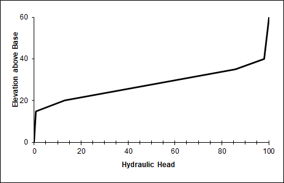

# David Morales, 1/24/2022, HW1

## Challenge Responses:
1. I repeated the process for both a homogenous and heterogenous system although I only submitted a model for the heterogenous system; it was unclear if I needed to submit two separate sheets demonstrating each system.
2. Beneath the *Direct Solution for Flux* box, I added my own calculations for **q** and **Keq** using the corresponding values obtained from the direct calculations above; I believe that's what was meant by the directions to "show that the steady state flux agrees with the direct calculation based on the harmonic mean average K."

    As for the equation for flux, it is: q = Keq(dH/dL)

3. In the graph below, three different K-values are expressed in the column:
   - Node 1-5: K = 0.005
   - Node 6-9: K = 0.0004
   - Node 10-13: K = 0.01
  
     

4. Looking at the head profile, we see two steep portions bookending a long, shallow middle (the quality of the slope is relative to your perspective). These two end portions represent the layers of the column with relatively high K-values compared to the "lower" of the K-values. In fact, very little head is lost as water travels through the ends of the column as indicated by their steepness. Thus, in order account for the set Type 1 boundary conditions, the equivalent K-value must reflect the "difficulty" which water experiences as it travels through the column.